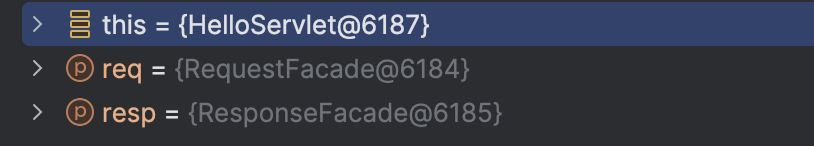
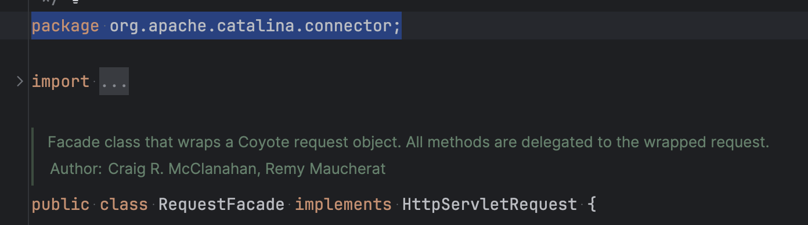
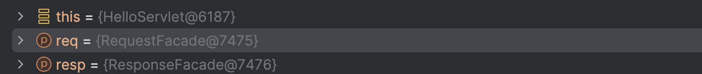
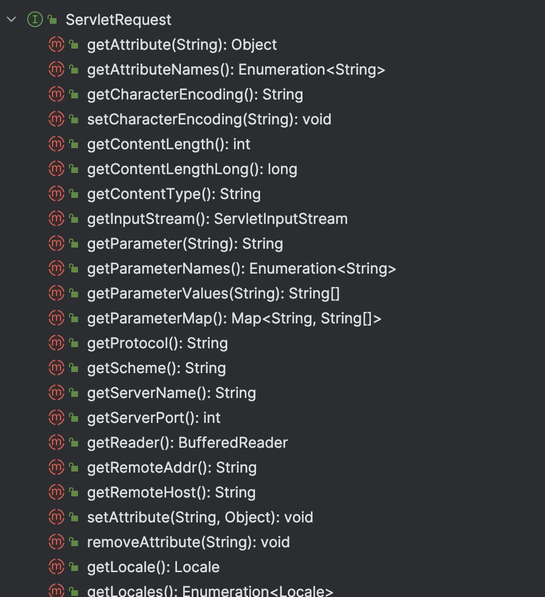
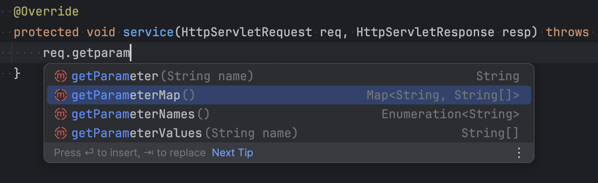
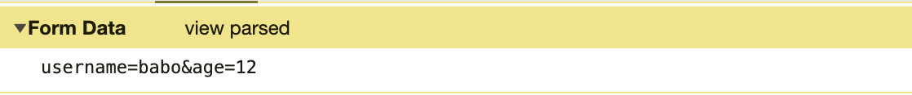
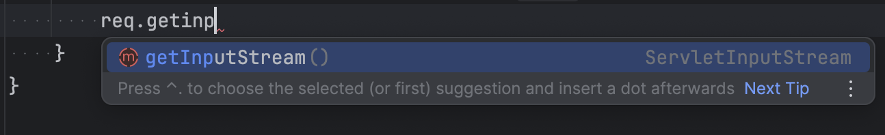

# 서블릿
## 서블릿 기본

섹션 1에서도 설명했지만 서블릿은 자바 EE 의 표준 스펙 중 하나이다.

서블릿은 서블릿 컨테이너가 매 요청 마다 개발자들이 HTTP (요청, 응답)을 편하게 사용하기 쉽게 요청과, 응답에 대한 인스턴스를 만들어준다.

```java
@WebServlet(urlPatterns = "/hello")
public class HelloServlet extends HttpServlet {
    @Override
    protected void service(HttpServletRequest req, HttpServletResponse resp) throws ServletException, IOException {
    }
}
```


디버깅으로 코드를 보면 요청 객의 구현체로 요청 (RequestFacade) 응답 (ResponseFacade) 가 생성되는걸 확인할 수 있다.

`RequestFacade` 와 `ResponseFacade` 는 아래와 같이 아파치의 구현체인걸 확인 할 수 있다. 매 요청 때마다 서블릿 컨테이너 (톰캣) 에서는 요청과 응답에 대한 객체를 매번 생성한다.



다시 한번 요청을 하면 인스턴스의 주소가 요청 `@7475` 응답 `@7476` 으로 **매 요청 마다 새로운 인스턴스가 생성한다.**  (전에 요청했을 때는 요청`@6184` 응답 `@6185` 이다.

하지만 `this = (HelloServlet)` 의 주소는 처음 요청과 똑같이 `@6187` 이다. 전 섹션에 공부한 것처럼 서블릿 컨테이너는 **서블릿들은 싱글톤 패턴으로 관리하기 때문이다.**



## HttpServletRequest

위에 설명한 것처럼 `HttpServletRequest` 은 HTTP의 요청 프로토콜을 사용하기 쉽게 인터페이스로 JAVA EE 가 제공한다. 구현체은 서블릿 컨테이너(Tomcat, Jetty … 같은 제품) 에서 제공한다.



겁나 많다.. 사진에 짤려서 그렇지 밑에 훨씬 더 많이 있다.  너무 많아서 강의에서 알려준 대표적인 3가지(Parameter, Form, Body) 만 소개 하겠다.  더 자세히 알고 싶으면 서블릿 인터페이스를 확인하자

### 쿼리 파라미터

쿼리 파라미터는 요청 URL에 `?` 로 시작해서 보낼 수 있고 `&` 으로 구분할 수 있다. 

위의 URL은 현재 수강하는 강의 URL인데 `courseSlug=스프링-mvc-1&unitId=71171&tab=curriculum` 이 부분들이 쿼리 파라미터라고 할 수 있다. 쿼리 파라미터는 `name`  와 `value` 로 나뉘어져있다. 또한 `name` 은 

- `courseSlug` 이 name, `스프링-mvc-1` 이 value가 되고
- `unitId` 이 name , `71171` 이 value가 된다.

또한 `name` 은 여러가지 `value` 를 가질 수 있다. 예를 들어 `lecture?courseSlug=스프링-mvc-1&courseSlug=스프링-mvc-2` 이런식으로 되어 있으면

- `courseSlug` 는 `스프링-mvc-2` , `스프링-mvc-1`  value를 가질 수 있다.



위와 같이 `HttpServletRequest` 파라미터를 조회할 수 있는 여러가지 메소드를 제공 해준다.

### FORM

HTTP 요청 헤더에 `Content-Type: application/x-www-form-urlencoded` 메시지 바디를 쿼리 파라미터 형식으로 보내면 위의 쿼리 파라미터의 메소드를 사용할 수 있다. 

URL 바디에 다음과 같은 정보를 담는다고 하면 이런식으로 사용할 수 있을거다.



```java
req.getParameter("username");
req.getParameter("age");
```

### Body

HTTP 메시지 바디에 데이터를 직접 담아서 요청하는 방식이다.  스프링이 아닌 순수 서블릿 요청은 `Content-Type` 에따라 변환 해주는 방식이 아닌 `ServletInputStream` 을 반환한다.



위에 말했듯이 순수 서블릿은 `Contnet-Type` 에 맞게 데이터들을 가공해주는 기능은 지원해주지 않는다. 사용자에 입맞에 알맞게 직접 변환시켜 사용해야 한다.

## HttpServletResponse

강의에서도 나왔지만 `HttpServletResponse` 은 HTTP 응답 메시지를 생성해주는 역할을 한다.

대표적으로 응답코드, 각종 헤더들, 바디가 되겠다.