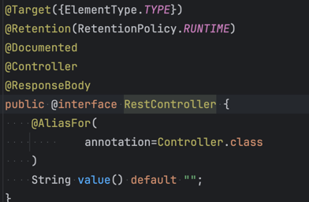
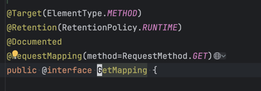

# 6. 기본 기능

## 매핑 정보

- `@RestController`
  - `@Controller` 는 반환 값이 `String` 이면 뷰 이름으로 인식되고 뷰를 찾고 렌더링을 하낟.
  - 하지만 `@RestController` 의 동작 방식은 뷰를 찾는게 아니라 **HTTP 메시지 바디를 응답 받을 수 있다**
  - 실제 `@Controller` 와 `@ResponseBody` 를 같이 쓴거랑 똑같이 작동하고 `@RestController` 내부에도 두 개의 애노테이션이 있다.
    
- `@RequestMapping`
  - `@RequestMapping("/hello/")` 처럼 뒤에 `value` 의 URL 이랑 매핑 시켜준다.
  - 배열로도 다중 설정이 가능하다.
  - `@RequestMapping("/hello/", method = RequestMethod.GET)` 와 같이 HTTP 메소드를 지정할 수 있다, 이것도 배열로도 다중 설정이 가능하다. 만약 해당 URL은 없지만 메소드가 존재하지 않으면 405 Method Not Allowed 를 응답한다.
  - 그리고 `@RequestMapping` 에 메소드를 지정하는 방법보다는 HTTP 축약한 편의 애노테이션을 제공하고 이 애노테이션들을 사용하는게 더 직관적이다.
    - `@GetMapping`
    - `@PostMapping`
    - `@PutMappiong`
    - `@DeleteMapping`
    - 편의 애노테이션들도 전부 실제 코드를 까보면 `@RequestMapping` 이 적용되있다.
    
- 경로 변수 `@PathVariable`
  - 경로 변수를 가져올 수 있는 기능이 제공된다. 경로 변수는 `/companies/{companyId}` 의 `{companyId}` 와 같이 {} 사이 변수를 지정하는 방법이다. REST API 라는 방식에서 자원과 자원에 대한 아이디를 표현할 때 사용한다.
  ```
    @GetMapping("/companies/{companyId}")
    public Company get(@PathVariable Long companyId){
        ...
    }
  ```
  - 위와 같이 매핑 애노테이션의 value의 URL의 지정할 수 있고 컨트롤러의 파라미터에 @PathVariable 를 명시해주면 된다.
  - 여러개의 @PathVariable 를 지정할 수 있다.
  
