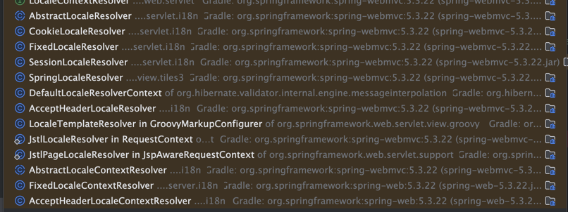

## 메시지, 국제화

스프링에서 지원하는 'message.properties' 를 이용하면 메시지 처리및 다국어 처리를 할 수 있다.

메시지를 관리하는 기능을 사용하려면 스프링의 `MessageSource` 사용하면 된다. 실제 구현체인 `ResourceBundleMessageSource` 를 사용해보자

```java
@Bean
public MessageSource messageSource() {
    ResourceBundleMessageSource messageSource = new ResourceBundleMessageSource();
    messageSource.setBaseNames("messages", "errors");
    messageSource.setDefaultEncoding("utf-8");
    return messageSource;
```

- `baseNames` 속성은 메시지 파일의 이름을 지정할 수 있다.
  - `messages.properties` 또는 `errors.properties` 로 된 메시지 파일을 사용할 수 있다.


파일은 /resources/messages.properties에 위치시킨다.

```properties
hello=안녕
```

- messages.properties : 기본 값으로 사용(한글)
- messages_en.properties : 영어 국제화 사용

스프링 부트를 사용하면 application.properties파일에 메시지 소스를 설정할 수 있다.

```properties
spring.messages.basename=messages,errors
```

설정을 따로하지 않으면 기본적으로 `messages.properties` 가 기본 이름이다.

## 타임 리프

```properties
hello=안녕
```

타임리프에서 위와 같은 메시지 프로퍼티가 있다면 `#{...}` 를 사용해서 등록한 메시지를 사용할 수 있다.

```html
<sapn th:text="#{hello}"> 123 </sapn>
```

## MessageSource

메시지 소스는 타임리프뿐만 아니라 

```java
public interface MessageSource {
    String getMessage(String code, @Nullable Object[] args, @Nullable String defaultMessage Locale locale);
    String getMessage(String code, @Nullable Object[] args, Locale locale) throws NoSuchMessageException;
}
```
- 첫번째 파라미터 `code` 는 메시지 값의 코드이다.
- 두번째 파라미터는 `code` 에 대한 파라미터다.
- 세번째는 언어를 선택할 수 있다 `Locale.Korean` - `messages.ko_properties`

위에 빈으로 

## LocalResolver

스프링은 `Locale` 을 변경할 수 있도록 `LocaleResolver` 를 제공해주는데 스프링 부트는 HTTP 요청시
HTTP 헤더에 `Accept-Language`를 활용하는 `AacceptHeaderLocaleResolver` 를 기본적으로 설정되어 있다.

```java
public interface LocaleResolver {
	Locale resolve(LocaleResolverContext context);
}
```

스프링에서는 다양한 `LocaleResolver` `를 제공해준다. 필요시 변경해주면 되고 커스텀으로 만들어도 무반하다.



참고로 `LocaleResolver` 는 `DispatcherServlet` 의 `View` 를 렌더링할 때 자동적으로 호출된다.