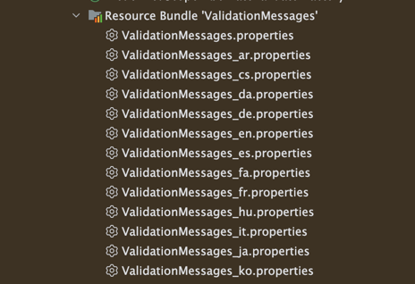
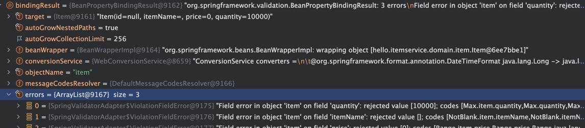
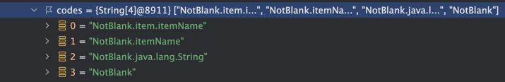
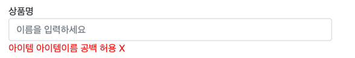

# Bean Validation

Bean Validation 검증에 필요한 애노테이션과 인터페이스를 제공하는 자바 EE (17 부터는 Jakarta EE) 이라는 표준 기술이다.
일반적으로 사용하는 구현체는 하이버네이트가 있다.

아래와 같이 섹션 4에서 직접 로직을 작성하는 방법들을 애노테이션으로 검증 로직을 편리하게 적용할 수 있다

```java
public class Item {

    @NotBlank
    private String itemName;
    
    @NotNull
    @Range(min = 1000, max = 1000000)
    private Integer price;
    
    @NotNull
    @Max(9999)
    private Integer quantity;
}
```

- `@NotBlank` - 해당 필드의 공백을 검증한다.
- `@NotNull`  - 해당 필드의 `Null` 여부를 검증한다.
- `@Range`    - 해당 필드의 MIN ~ MAX 범위를 검증한다
- `@Max`      - 해당 최대 값을 검증한다

>**참고**
>
>`jakarta.validation.constraints.NotNull`
>
>`org.hibernate.validator.constraints.Range`
>
>`jakarta.validation` 으로 시작하면 특정 구현에 관계없이 제공되는 표준 인터페이스이고,
>`org.hibernate.validator` 로 시작하면 하이버네이트 validator 구현체를 사용할 때만 제공되는 검증 기 능이다. 실무에서 대부분 하이버네이트 validator를 사용하므로 자유롭게 사용해도 된다.


그 외 컬렉션에 대한 검증이나 이메일 검증등 다양한 기본 기능들을 제공하니 필요시 공식문서를 참고하자
- https://docs.jboss.org/hibernate/stable/validator/reference/en-US/html_single/

사용하기 앞서 build.gradle 에 의존성을 다음과 같이 작성해주자

```groovy
implementation 'org.springframework.boot:spring-boot-starter-validation'
```

## ValidationFactory

```java
@Test
void validation() {
    ValidatorFactory validatorFactory = Validation.buildDefaultValidatorFactory();
    Validator validator = validatorFactory.getValidator();

    Item item = new Item("", 999, 10000);

    Set<ConstraintViolation<Item>> constraintViolations = validator.validate(item);
    for (ConstraintViolation<Item> constraintViolation : constraintViolations) {
        System.out.println(constraintViolation);
        System.out.println(constraintViolation.getMessage());
    }
}
```

결과
```java
ConstraintViolationImpl{interpolatedMessage='must be between 1000 and 1000000', propertyPath=price, rootBeanClass=class hello.itemservice.domain.item.Item, messageTemplate='{org.hibernate.validator.constraints.Range.message}'}
must be between 1000 and 1000000
        
ConstraintViolationImpl{interpolatedMessage='must not be blank', propertyPath=itemName, rootBeanClass=class hello.itemservice.domain.item.Item, messageTemplate='{jakarta.validation.constraints.NotBlank.message}'}
must not be blank

ConstraintViolationImpl{interpolatedMessage='must be less than or equal to 9999', propertyPath=quantity, rootBeanClass=class hello.itemservice.domain.item.Item, messageTemplate='{jakarta.validation.constraints.Max.message}'}
must be less than or equal to 9999
```

참고로 기본 메시지코드는 `org/hibernate/validator/resources` 에서 관리하고 있다. 



ValidationMessages.properties 를 확인해보면 위에 `messageTemplate` 라고 정의된 속성값이랑 일치하는걸 확인할 수 있다

```properties 
...
jakarta.validation.constraints.Max.message             = must be less than or equal to {value}
jakarta.validation.constraints.Min.message             = must be greater than or equal to {value}
jakarta.validation.constraints.NotBlank.message        = must not be blank
jakarta.validation.constraints.NotNull.message         = must not be null

org.hibernate.validator.constraints.Range.message      = must be between {min} and {max}
...
```

스프링과 통합하면 이러한 코드로 작성하는 일은 많지 않을거다. 내부적으로 이런 로직이 돌아가는구나 정도로만 이해하자

## 스프링 통합

처음 우리가 그래들 모듈을 추가하면 `implementation 'org.springframework.boot:spring-boot-starter-validation'` 

자동적으로 `LocalValidatorFactoryBean` 를 빈으로 둥록한다. `LocalValidatorFactoryBean` 는 컨트롤러 메소드를 호출전에 내부적으로 `@Valid` 또는 `@Validated` 코드가 있으면 
자동으로 검증을 하고 `BindingResult` 에 담아준다.

`@Valid` 및 `@Validated` 애노테이션은 `@ModelAttribute` 또는 요청 파라미터 또는 `@RequestBody` 에 사용할 수 있다. 

### 필드 검증

```java
...
public class Item {

   @NotBlank
   private String itemName;

   @NotNull
   @Range(min = 1000, max = 1000000)
   private Integer price;

   @NotNull
   @Max(9999)
   private Integer quantity;
   
   ...
}
```

```java
@PostMapping("/add")
public String addItem(@ModelAttribute @Valid Item item, BindingResult bindingResult) {
   ....
}
```

```http request

POST http://localhost:8080/validation/v1/items/add
Content-Type: application/x-www-form-urlencoded

itemName=&price=0&quantity=10000
```

실제 검증을 실패하도록 요청을 보내면 원하는 에러 값이 담긴 `BindingResult` 을 받을 수 잇다.




### 오류코드와 메시지

오류코드는 기본적으로 하이버네이트에서 제공하는 메시지를 사용하지만 애노테이션에 `message` 속성의 값에 넣을 수 있고 메시지 파일 `messages.properties` 에 직접 값을 설정할 수 있다.

**BeanValidation 메시지 찾는 우선 순위는** 다음과 같다.

1. 메시지를 규칙에 맞게 작성
   - `messages.propeteis` 같은 직접 규칙에 맞게 작성
2. 애노테이션의 `message` 속성 사용
    -  `@NotBlnak(message = "공백은 허용되지 않습니다")`
4. 라이브러리에서 제공하는 기본 값 
   - `org/hibernate/validator/resources/ValidationMessages.properties` 에서 제공해주는 값


메시지를 직접 `messages.propeties` 에서 직접 작성할 수 있는데 몇가지 규칙이 있다. 

커스텀 메시지 규칙
1. `code + "." + object name + "." + field`
2. `code + "." + field`
3. `code + "." + field type`
4. `code`

`BindingResult` 에서 `itemName` 으로된 필드에러 객체를 확인해보면 메시지에 대한 정보들이 있다.



우선 순위는 가장 디테일한 코드에서 디테일하지 않은 순으로 설정되고 설정된 값이없으면 기본적으로 지원하는 `NotBlnak` 에 대한 값이 나온다.

> 참고로 이 코드에 대한 규칙을 정의할 수 있는 인터페이스는 `MessageCodeResolver` 스프링에서 기본 적으로 제공하는 구현체는 `DefaultMessageCodesResolver` 이다.

한번 메시지를 직접 수정해보자
```properties
NotBlank.item.itemName=아이템 아이템이름 공백 허용 X
NotBlank.itemName=아이템이름 공백 허용 X
NotBlank=공백 허용 X
```

3 가지를 지정했는데 실제 메시지가 적용된 화면을 조회해보면 가장 구체적인  `NotBlank.item.itemName` 의 메시지가 적용된걸 확인할 수 있다.



## Form 객체 분리

동일한 모델 객체를 등록할 때와 수정할 때 각각 다르게 검증하는 방법을 알아보자.

**방법 2가지**
- BeanValidation의 groups 기능을 사용한다.
- Item을 직접 사용하지 않고, ItemSaveForm, ItemUpdateForm 같은 폼 전송을 위한 별도의 모델 객체를 만들 어서 사용한다.

예를 들어서

```java
public interface SaveCheck {
}

public interface UpdateCheck {
}

@Data
public class Item {
    
    @NotNull(groups=UpdateCheck.class) //수정시에만 적용 private Long id;
    @NotBlank(groups={SaveCheck.class, UpdateCheck.class})
    private String itemName;
    
    @NotNull(groups={SaveCheck.class, UpdateCheck.class})
    @Range(min=1000, max=1000000, groups={SaveCheck.class, UpdateCheck.class})
    private Integer price;

    @NotNull(groups={SaveCheck.class, UpdateCheck.class})
    @Max(value=9999, groups=SaveCheck.class) //등록시에만 적용 private Integer quantity;
    private Integer quantity;
}
```

```java
 @PostMapping("/add")
 public String addItemV2(@Validated(SaveCheck.class) @ModelAttribute Item item,
 BindingResult bindingResult, RedirectAttributes redirectAttributes) {
//...
}

 @PostMapping("/{itemId}/edit")
 public String editV2(@PathVariable Long itemId, @Validated(UpdateCheck.class)
 @ModelAttribute Item item, BindingResult bindingResult) {
//...
}
```

실무에서는 `groups` 를 잘 사용하지 않는데, 그 이유가 다른 곳에 있다. 바로 등록시 폼에서 전달하는 데이터가 `Item` 도메인 객체와 딱 맞지 않기 때문이다.

두번째로는 `Form` 을 분리하는 방법이 있다. 가장 실무에서 많이 사용하는 방법이다.

`Form` 을 분리하면 다음과 같은 장점이 있다.

1. 도메인 객체와 화면에 대한 의존성을 분리할 수 있다.
2. 기능에 맞게 책임을 분리할 수 있다.
   - 슈퍼 DTO 방지..
   - 화면의 기능에 맞게 분리
   

```java
 @Data
 public class ItemSaveForm {
     @NotBlank
     private String itemName;
     @NotNull
     @Range(min = 1000, max = 1000000)
     private Integer price;
     @NotNull
     @Max(value = 9999)
     private Integer quantity;
}

 
 @Data
 public class ItemUpdateForm {
     @NotNull
     private Long id;
     
     @NotBlank
     private String itemName;
     
     @NotNull
     @Range(min=1000, max=1000000)
     private Integer price;
     
    //수정에서는 수량은 자유롭게 변경할 수 있다. private Integer quantity;
    private Integer quantity;
 }
 
```

## 질문

1. `@Valid` 또는 `@Validated` 애노테이션은 어디에 적용하면 되고 무슨 역할을 하나요? 
2. **BeanValidation 메시지 찾는 순서** 의 우선순위는 어떻게 되나요?
   - ex) 애노테이션의 `message` 속성 사용, 직접 메시지 작성, 라이브러리에서 제공되는 값
3. Form 객체를 분리하면 어떠한 이점이 있나요?

