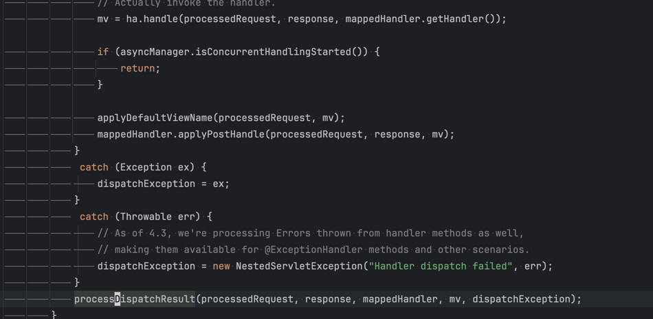
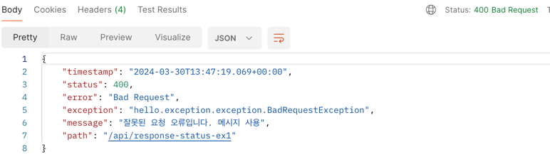

# API 예외처리

## 스프링 부트 `BasicController`

전 섹션에 공부 했던 것 처럼 API 기본 예외도 스프링부트 기본 에러를 처리하는 `BasicController` 가 기본 기능을 제공해준다.

```java
    @RequestMapping
    public ResponseEntity<Map<String, Object>> error(HttpServletRequest request) {
        HttpStatus status = this.getStatus(request);
        if (status == HttpStatus.NO_CONTENT) {
            return new ResponseEntity(status);
        } else {
            Map<String, Object> body = this.getErrorAttributes(request, this.getErrorAttributeOptions(request, MediaType.ALL));
            return new ResponseEntity(body, status);
        }
    }
```


```java

@ResponseBody
@GetMapping("/api2/members/{id}")
public MemberDto getMember(@PathVariable("id") String id) {

    if (id.equals("ex")) {
        throw new RuntimeException("잘못된 사용자");
    }
    ...“
}
```

위와 같은 컨트롤러가 있고 API 요청을 보냈을 때 위에 `BasicController` 가 제공하는 기본 예외가 발생한다.

```json
{
  "timestamp": "2024-03-30T12:17:43.939+00:00",
  "status": 500,
  "error": "Internal Server Error",
  "exception": "java.lang.RuntimeException",
  "message": "잘못된 사용자",
  "path": "/api/members/ex"
}
```

스프링 부트의 `application.properties` 설정으로 좀 더 자세히 설정할 수 있다.
너무 많은 메시지를 추가하면 보안상 위험할 수 있으니 참고하자

```properties
server.error.include-exception=true
server.error.include-message=always
server.error.include-stacktrace=on_param
server.error.include-binding-errors=on_param
```

## HandlerExceptionResolver

스프링 MVC는 컨트롤러 내부에서 예외가 발생했을 때 예외를 해결하고, 동작을 새로운 방식으로 제공해주는 `HadnlerExceptionResolver` 인터페이스를 제공한다.

```java
public interface HandlerExceptionResolver {
    @Nullable
    ModelAndView resolveException(HttpServletRequest var1, HttpServletResponse var2, @Nullable Object var3, Exception var4);
}
```


`HandlerExceptionResolve` 는 `DispatcherServlet` 에서 핸들러 어댑터 (컨트롤러)가 호출한 후에 실행한다.

또한 `HadnlerExceptionResolver` 를 사용하면 


스프링 부트에서 기본적으로 제공하는 `ExceptionResolver` 는 다음과 같다.

- `ExceptionHandlerExceptionResolver`
- `ResponseStatusExceptionResolver`
- `DefaultHandlerExceptionResolver`

`ResponseStatusExceptionResolver` 는 예외에 `ResponseStatus` 가 존재하면 예외를 처리해주는 `ExceptionResolver` 이다.

```java
@ResponseStatus(code = HttpStatus.BAD_REQUEST, reason = "error.bad")
public class BadRequestException extends RuntimeException {
}
```

위의 `BadRequestException` 에러가 발생하면



상태 코드가 400 와 메시지화된 에러를 응답한다.

`DefaultHandlerExceptionResolver` 는 스프링 MVC 에서 발생할 수 있는 수많은 에러를 처리해준다.

예를 들어 파라미터 바인딩시 타입이 올바르지 않을 경우 `TypeMismatchException` 에러가 발생하는데
400 상태 코드와 에러 메시지를 만들어준다.

그밖에 다양한 에러를 처리해주니 궁금하면 직접 코드를 확인해보자

`ExceptionHandlerExceptionResolver` 

